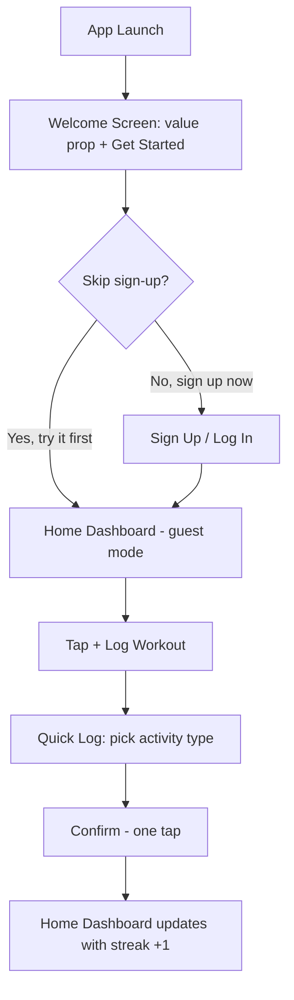
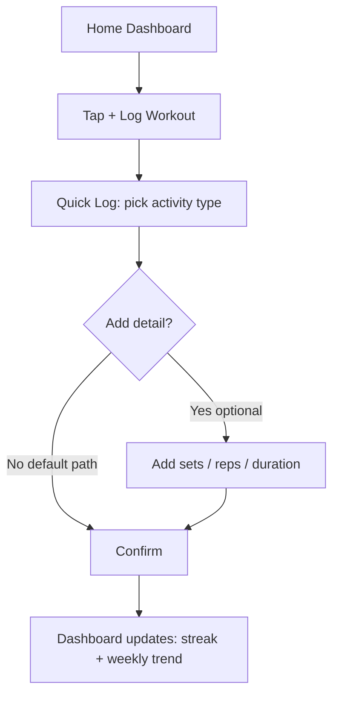
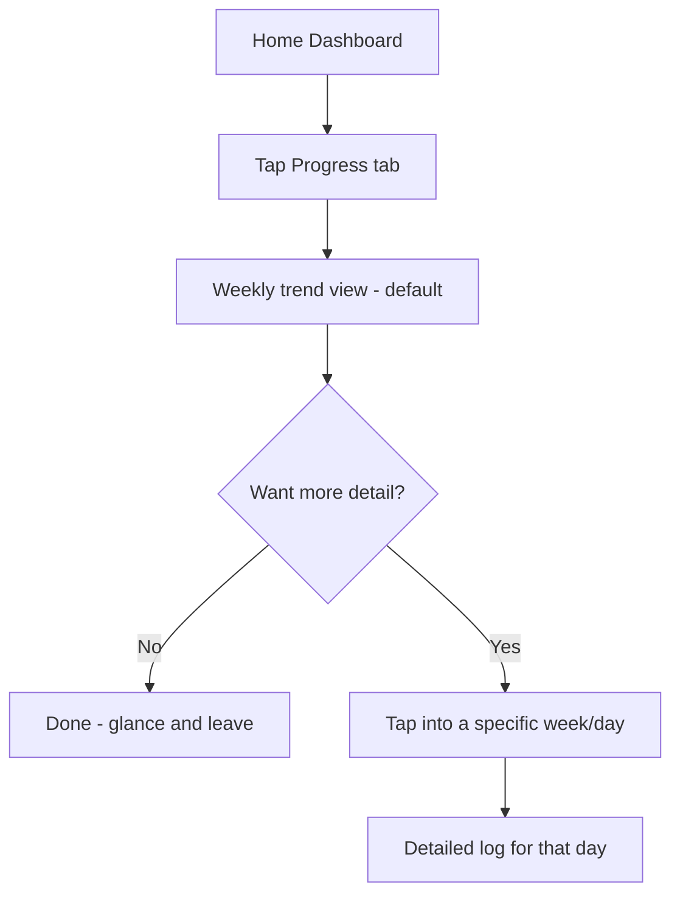

# User Flows — FitTrack

Three core flows are mapped below, each tied back to a user need from the research. GitHub renders Mermaid diagrams natively in this file.

---

## Flow 1: First-Time Onboarding → First Log

**Addresses:** N3 (get to value before account creation), N1 (fast logging)

**Design implication:** account creation is optional and deferred; a user can reach a completed workout log entirely in guest mode. This directly answers the "onboarding overload" drop-off finding.

---

## Flow 2: Logging a Workout (Returning User)

**Addresses:** N1 (minimal taps), N4 (optional depth for power users)

**Design implication:** the "Add detail" step is optional and collapsed by default, so Maya's flow is 2 taps and Daniel's flow is 3–4 taps when he wants it — same screen, two speeds.

---

## Flow 3: Checking Progress

**Addresses:** N2 (glanceable trend over raw data)

**Design implication:** the default Progress screen shows a simple trend, not a data table — detail is one tap deeper, never the first thing shown.

---

## How These Flows Map to Wireframes

| Flow step | Wireframe screen |
|---|---|
| Welcome Screen | `01-onboarding.svg` |
| Sign Up / Log In | `02-signup-login.svg` |
| Home Dashboard | `03-home-dashboard.svg` |
| Quick Log / Add detail | `04-log-workout.svg` |
| Progress / weekly trend | `05-progress-stats.svg` |
| Account / guest settings | `06-profile.svg` |

See [`../04-wireframes/wireframes.md`](../04-wireframes/wireframes.md) for the screens themselves.
