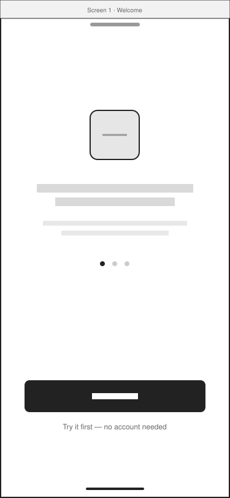
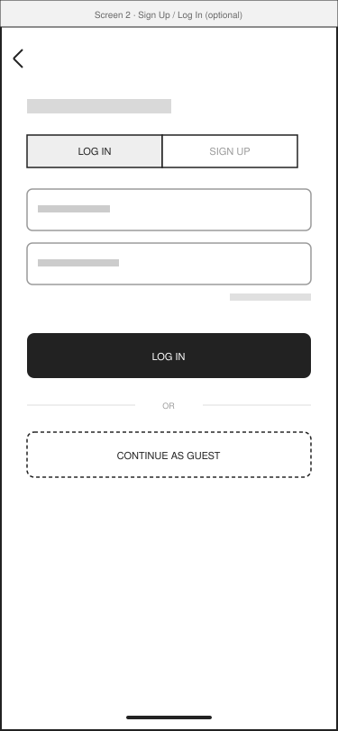
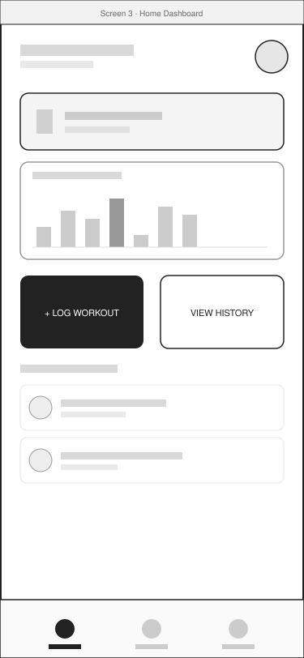
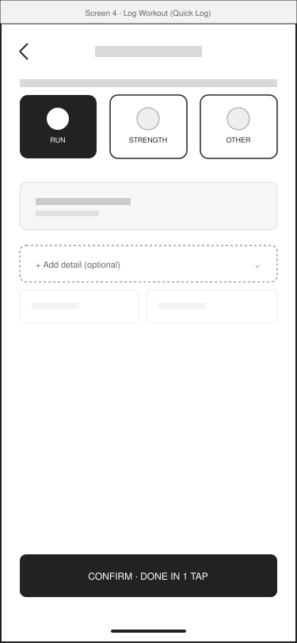
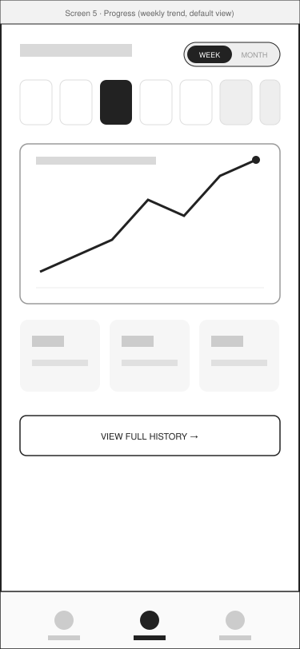
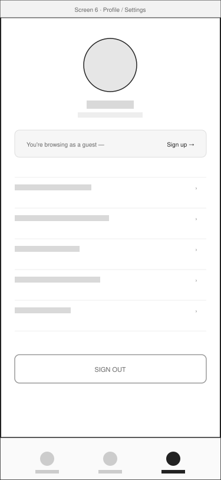

# Low-Fidelity Wireframes — FitTrack

All screens are 375×812 (standard mobile artboard), grayscale only, no real copy or icons — intentionally low-fidelity so structure and flow get evaluated before visual design does. Each screen maps to a step in [`../03-user-flows/user-flows.md`](../03-user-flows/user-flows.md).

---

### Screen 1 — Welcome / Onboarding

- Single value-prop headline + subtext, one logo placeholder, pagination dots for a short (2–3 slide) intro carousel.
- Primary CTA is **Get Started**; secondary link is **Try it first**, which skips account creation entirely.
- **Why:** research (Finding 4) showed onboarding overload as a top drop-off cause — this screen intentionally has one decision, not a form.

### Screen 2 — Sign Up / Log In (optional)

- Tabbed Log In / Sign Up with standard email + password fields.
- A dashed-border **Continue as Guest** button is equally prominent as the auth CTA, not buried below the fold.
- **Why:** answers need N3 — a user should be able to reach real app value before committing to an account.

### Screen 3 — Home Dashboard

- Greeting header, a streak card (glanceable win), a compact weekly-trend mini chart, two large quick-action buttons (**+ Log Workout** is visually dominant), and a short recent-activity list.
- Bottom nav: Home / Progress / Profile — flat, 3-tab structure, no nested menus.
- **Why:** the streak + trend combination directly answers N2 and N5 — motivation from a glance, not gamified point systems.

### Screen 4 — Log Workout (Quick Log)

- Three large single-tap activity-type cards (Run / Strength / Other) — picking one is the entire "quick path."
- An **Add detail (optional)** accordion is collapsed and visually de-emphasized by default; expanding it reveals sets/reps/duration fields.
- One confirm button labeled to reinforce speed: "Done in 1 tap."
- **Why:** this single screen serves both personas — Maya never opens the accordion (2-tap flow), Daniel opens it when he wants structure (N1 + N4 resolved on one screen instead of two separate flows).

### Screen 5 — Progress (weekly trend, default view)

- Week/Month toggle defaults to **Week**.
- A calendar strip for quick day selection, one large trend-line chart as the dominant element, and three small summary stat cards below it.
- A single "View full history" link leads to the detailed table — never shown by default.
- **Why:** directly answers N2 — the trend line is the first and biggest thing on the screen; raw numbers are one tap deeper for those who want them (Daniel).

### Screen 6 — Profile / Settings

- Standard settings list pattern (account, notifications, units, connected apps, about).
- A visible **"You're browsing as a guest — Sign up →"** banner surfaces the deferred-signup decision from Screen 1 without forcing it.
- **Why:** keeps the "optional account" promise visible and easy to act on later, rather than a one-time forced choice.

---

## Wireframing Conventions Used

- Gray filled rectangles = text/label placeholders (never real copy, to avoid reviewers reacting to wording instead of layout).
- Solid black shapes = the primary action on that screen (one per screen, by design).
- Dashed borders = optional/secondary elements (guest mode, add-detail accordion).
- No color, shadows, icons, or imagery — reserved for the high-fidelity/visual design pass, which is intentionally out of scope for this task.
